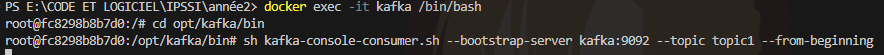
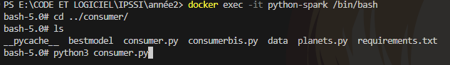
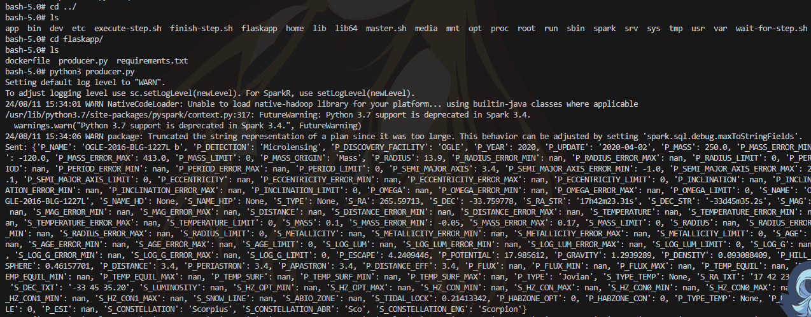

# Planetarium

Welcome to Planetarium! This project utilizes App Spark, Hadoop, Kafka, and Machine Learning to classify planets and determine their habitability.

## Contributors

- Ali-Haïdar ATIA
- Lucas MONNET-POUPON
- Simon DANIEL
- Damien SALEM

## Data

Les datas proviennent de ce site : <https://phl.upr.edu/hwc>
Qui regroupe des datas de la NASA et d'autres sites.

## Etapes de creation du projet

1. Création du `docker-compose.yml` avec Spark, Hadoop, Kafka et Hive
2. Récupération des données du csv depuis le `producer`
3. Nous avons créer un modèle de machine learning avec une partie des datas pour savoir si une planète est habitable ou non avec un jupyter notebook sur google colab. Ici on ne retrouve que le modèle déjà entrainé.
4. Le processing des données est effectué avec le fichier `planets.py` avec une pipeline.
5. Processing des données et utilisation du modèle dans le `consumer`.
6. A la fin, la prédiction est sauvegardé dans Hive

## Installation

To get started with Planetarium, follow these steps:

1. Clone the repository: `git clone https://github.com/your-username/planetarium.git`

## Usage

Save data in Hadoop

You need to have the data in your shared environnement as specified in the docker-compose file, here the folder is 'myhadoop'

``` bash
docker exec -it namenode /bin/bash
hdfs dfs -mkdir /planetarium
hdfs dfs -put /data/hwc.csv /planetarium
```


start kafka

``` bash
docker exec -it kafka/bin/bash
sh kafka-console-producer.sh --bootstrap-server kafka:9092 --topic topic1
```



start consumer

``` bash
docker exec -it python-spark /bin/bash
python3 /consumer/consumer.py
```



start producer

``` bash
docker exec -it flask-app /bin/bash
python3 /flaskapp/producer.py
```




## Contributing

Contributions are welcome! If you would like to contribute to Planetarium, please follow these guidelines:

1. Fork the repository.
2. Create a new branch: `git checkout -b feature/your-feature`
3. Make your changes and commit them: `git commit -m 'Add your feature'`
4. Push to the branch: `git push origin feature/your-feature`
5. Submit a pull request.

## License

This project is licensed under the MIT License. See the [LICENSE](./LICENSE) file for more information.

## Contact

If you have any questions or suggestions, feel free to reach out to us at planetarium@example.com.
